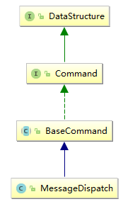

# 说明

单开此文件的目的是原先的笔记记录与较早之前，现在看起来不是那么尽如人意。在这里用另外一个全新的角度说明一些重要问题。

# 组件结构

首先用最简单的启动消费者的方法开始:

```java
ConnectionFactory connectionFactory = new ActiveMQConnectionFactory(ActiveMQConnection.DEFAULT_USER,
    ActiveMQConnection.DEFAULT_PASSWORD, "tcp://localhost:61616");
Connection connection = connectionFactory.createConnection();
connection.start();
Session session = connection.createSession(Boolean.FALSE, Session.AUTO_ACKNOWLEDGE);
Destination destination = session.createQueue("foo.bar");
MessageConsumer consumer = session.createConsumer(destination);
while (true) {
    consumer.receive();
}
```

用流程图来表示这一过程:


进一步，Connection、Session、Consumer以及MessageListener的存储结构如下图：


## ConsumerId

下面看一下这个消费者ID究竟是个什么东西，创建的入口位于ActiveMQSession的createConsumer方法:

```java
public MessageConsumer createConsumer(Destination destination, String messageSelector, boolean noLocal, MessageListener messageListener) {
    //...
    return new ActiveMQMessageConsumer(this, getNextConsumerId(), activemqDestination, null, messageSelector,
            prefetch, prefetchPolicy.getMaximumPendingMessageLimit(), noLocal, false, isAsyncDispatch(), messageListener);
}
```

由getNextConsumerId()方法创建:

```java
protected ConsumerId getNextConsumerId() {
    return new ConsumerId(info.getSessionId(), consumerIdGenerator.getNextSequenceId());
}
```

consumerIdGenerator其实就是对一个long型数字进行累加。

## ActiveMQDispatcher

从上面的存储结构图中可以看出，Connection同样记录了从ConsumerId到ActiveMQDispatcher的映射，其实在这里**ActiveMQDispatcher就是ActiveMQSession**，类图:


此接口只有一个方法:

```java
void dispatch(MessageDispatch messageDispatch);
```

下面看看被分发的MessageDispatch是个什么东西:



# 消息是如何接收的

有了上面存储结构说明的铺垫，这一部分将容易理解许多。

TcpTransport的父类TransportThreadSupport的doStart方法创建了一个线程，专门用于接收服务器传来的各种东西，包括Queue消息、Topic消息以及控制命令。

同时MQ维护了一条调用链，用于依次处理收到的东西，关于这条链是如何构成的，参考以前的笔记。

这里我们重点关注调用链的末端--ActiveMQConnection的onCommand方法:

```java
@Override
public void onCommand(final Object o) {
    final Command command = (Command)o;
    if (!closed.get() && command != null) {
        try {
            command.visit(new CommandVisitorAdapter() {
                @Override
                public Response processMessageDispatch(MessageDispatch md) {
                    ActiveMQDispatcher dispatcher = dispatchers.get(md.getConsumerId());
                    dispatcher.dispatch(md);
                    return null;
                }
            }
        }
    }
    //...
}
```

很容易理解，下面就是ActiveMQSession的dispatch方法:

```java
@Override
public void dispatch(MessageDispatch messageDispatch) {
    executor.execute(messageDispatch);
}
```

execute方法的实现位于ActiveMQSessionExecutor:

```java
void execute(MessageDispatch message) throws InterruptedException {
    if (!session.isSessionAsyncDispatch() && !dispatchedBySessionPool) {
        dispatch(message);
    } else {
        messageQueue.enqueue(message);
        wakeup();
    }
}
```

很明显，这里的分发支持同步和异步两种模式。
